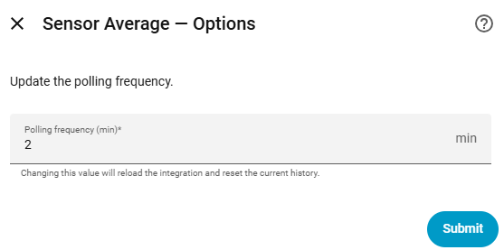

# Home Assistant - WattKeeper Sensor Average

> Compute a rolling average of any numeric sensor at a configurable frequency. The result is exposed as a new sensor you can use in your automations, dashboards and energy monitoring.

### Add the custom software to your Home Assistant with the following link

### Add the integration to your Home Assistant

## Features

- Calculates a rolling average of any numeric sensor.
- Configurable polling frequency (1 to 1440 minutes) — default is **1 minute**.
- Frequency can be changed at any time from the integration options, without removing it.
- The generated sensor inherits the **unit of measurement** and **device class** from the source sensor.
- Exposes additional attributes: `source_sensor`, `last_value`, `sample_count`.
- Keeps up to **1 440 samples** in memory (24 h at 1 sample/minute).
- Compatible with Home Assistant **long-term statistics** (`state_class: measurement`).

### You can easily configure the source sensor and the frequency

### You can update the frequency at any time from the integration options

